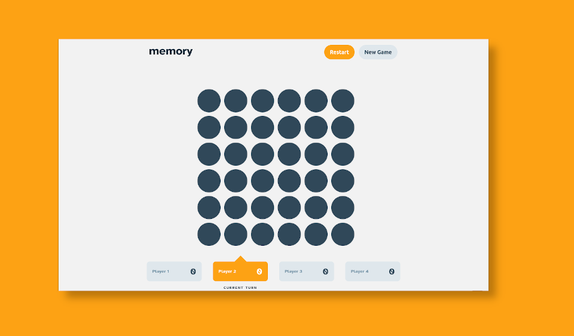

# Frontend Mentor - Memory game solution

This is a solution to the [Memory game challenge on Frontend Mentor](https://www.frontendmentor.io/challenges/memory-game-vse4WFPvM). Frontend Mentor challenges help you improve your coding skills by building realistic projects. 

## Table of contents

- [Overview](#overview)
  - [The challenge](#the-challenge)
  - [Screenshot](#screenshot)
  - [Links](#links)
- [My process](#my-process)
  - [Built with](#built-with)
  - [What I learned](#what-i-learned)
  - [Continued development](#continued-development)
- [Author](#author)

## Overview

### The challenge

Users should be able to:

- View the optimal layout for the game depending on their device's screen size
- See hover states for all interactive elements on the page
- Play the Memory game either solo or multiplayer (up to 4 players)
- Set the theme to use numbers or icons within the tiles
- Choose to play on either a 6x6 or 4x4 grid

### Screenshot

### Links

- [Solution URL]: [Add solution URL here](https://your-solution-url.com)
- [Live Site](https://acw-portfolio.github.io/fe-mentor-memory-game/)

## My process

### Built with

- Wick - [ Component Compiler ](https://github.com/CandleLibrary/candle-library-workspace/tree/versions/packages/wick)
- Glow - [ JS Animations and Transitions](https://github.com/CandleLibrary/candle-library-workspace/tree/versions/packages/glow)
- CSS Flexbox
- CSS Transforms

### What I learned

I worked on this longer than expected. It forced me implement new features to the libraries I've been working on to ensure smooth
transitions between pages and consistent game state between pages. I've been modifying my workflow to define more base components
that can be reused on different pages. This includes the buttons, menu frames, and labels for player information.

### Continued development

I really benefited from being able to use hot-component reloading to update my live views on multiple devices and browser windows simultaneously.
The experience was a little rocky with the current implementation of Wick, but it proved to be very useful as I developed the site alongside
making modifications to Wick. I want to look into adding hot-module reloading at some point to get the same experience while developing
logic outside of components. 
## Author

- Frontend Mentor - [@acweathersby](https://www.frontendmentor.io/profile/acweathersby)
